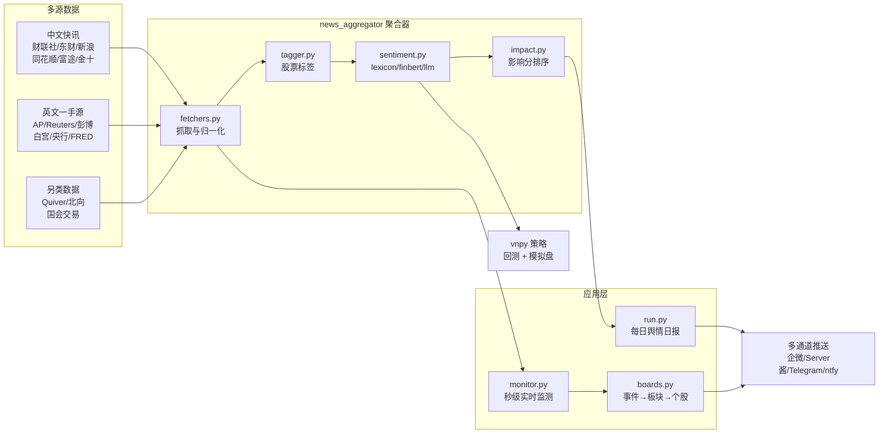

<div align="center">

# 📈 chaogu · 炒股量化工具箱

**多源新闻舆情聚合 · 秒级事件监测 · 新闻情绪量化策略**

> 聚合 35+ 金融数据源，用影响分捕捉「影响股价最快的信息」，基于 vnpy 跑通回测与模拟盘。

[](https://github.com/pipi-520/chaoguku/stargazers)
[](https://github.com/pipi-520/chaoguku/network/members)
[](LICENSE)
[](https://www.python.org/)
[](https://github.com/pipi-520/chaoguku/commits/master)

[中文](README.md) · [English](README_EN.md)

</div>

---

## ✨ 这是什么

`chaogu` 是一套面向 A 股 + 美股的开源量化研究工具，核心解决一个问题：

> **如何最快地捕捉「影响股价的新闻」，并把它变成可回测、可执行的信号？**

它把「数据采集 → 情绪打分 → 影响分排序 → 实时告警 → 量化策略」整条链路串了起来，全部本地/云上可跑、免费可复现。

## 🧩 核心特性

- **35+ 数据源聚合**：中文快讯（财联社电报 / 东财 7×24 / 新浪 / 同花顺 / 富途牛牛 / 华尔街见闻 / 金十快讯）+ 英文一手源（AP / Reuters / 彭博）+ 央行与宏观（美联储 / ECB / BOJ / 人行 / FRED / CPI / 非农）+ 另类数据（Quiver / 北向资金 / 国会交易）。
- **可插拔情绪引擎**：`lexicon` 离线词典（零依赖、秒回）、`finbert` 金融大模型、`llm`（OpenAI 兼容），失败自动回退词典。
- **影响分模型**：综合「来源权威度 × 突发爆发 × 情绪强度 × 持仓相关度 × 主题热度」，把真正重要的新闻排在前面。
- **秒级事件监测**：15 秒轮询 + 去重 + 事件词 → A股概念/行业板块 → 个股映射，命中即推送，只告警不下单。
- **多通道推送**：企业微信 / Server酱（微信）/ Telegram / ntfy。
- **vnpy 量化落地**：新闻情绪驱动 CTA 策略，跑通历史回测 + 本地模拟盘（Paper Trading）。
- **开箱即用部署**：GitHub Actions 日报 + systemd 24/7 监测 + Docker，一键脚本 + 自检脚本。

## 🏗️ 架构



## 🚀 快速开始

### 1. 安装依赖（Python 3.12）

```bash
python -m venv .venv
# Windows
.venv\Scripts\python -m pip install -r requirements.txt
# Linux / macOS
.venv/bin/python -m pip install -r requirements.txt
```

### 2. 跑一次新闻聚合 + 生成日报

```bash
python news_aggregator/run.py          # 抓取 + 情绪分 + 影响分 + 日报
python news_aggregator/run.py --push   # 并推送到企业微信
```

### 3. 启动秒级事件监测（24/7）

```bash
python news_aggregator/monitor.py               # 常驻轮询（默认 15s）
python news_aggregator/monitor.py --once        # 只跑一轮
python news_aggregator/monitor.py --dry-run     # 只检测不推送
```

### 4. 跑量化回测 + 模拟盘

```bash
python scripts/download_data.py       # 下载行情
python scripts/sentiment_score.py     # 生成情绪分
python scripts/backtest.py            # vnpy 回测 -> results/
python scripts/paper_trade.py         # 本地模拟盘
python scripts/predictive_power.py    # 事件预测力回看
```

## 📂 项目结构

```
chaogu/
├─ news_aggregator/          # 多源聚合 + 实时监测核心
│  ├─ fetchers.py            #   35+ 数据源抓取
│  ├─ sentiment.py           #   lexicon / finbert / llm 情绪后端
│  ├─ impact.py              #   影响分模型（权威/爆发/强度/相关/主题）
│  ├─ boards.py              #   事件 → A股概念/行业板块 → 个股
│  ├─ themes.yaml            #   精选主题事件库（数据驱动，可扩展）
│  ├─ monitor.py             #   秒级实时监测器
│  ├─ run.py                 #   每日聚合 + 日报
│  ├─ tagger.py / push.py    #   标签 / 多通道推送
├─ strategies/               # vnpy CTA 策略
├─ scripts/                  # 行情/情绪/回测/模拟盘/部署脚本
├─ deploy/                   # systemd / Docker 部署
├─ news/                     # 原始新闻归档 + 情绪历史（每日自动累积）
└─ config.yaml               # 统一配置
```

## 🔔 告警示例

```
[事件告警] 创新药/疫苗
主题：创新药/疫苗
命中关键词：FDA / mRNA / 抗癌 / 疫苗
情绪分：+0.620　影响分：0.84
来源：财联社　时间：2026-08-21 20:30:00
原文：美国FDA批准某款mRNA抗癌疫苗三期临床成功……
相关板块：
- 创新药(概念)：恒瑞医药 +2.1%、药明康德 +1.8%
- 疫苗(概念)：智飞生物 +1.5%、沃森生物 +1.2%
```

## 📊 数据源一览

| 类别 | 来源 |
|---|---|
| 中文快讯 | 财联社电报 · 东财 7×24 · 新浪 7×24 · 同花顺 7×24 · 富途牛牛 · 华尔街见闻 · 金十快讯 · 政策公告 |
| 英文一手 | AP · Reuters · AFP · 彭博（Google News RSS） |
| 央行/宏观 | 美联储 · ECB · BOJ · BOE · 中国人民银行 · FRED · 非农/CPI · GDP/PCE · ISM PMI · EIA · OPEC/IEA · CFTC · VIX · AAII |
| 另类数据 | Quiver · 北向资金 · Bargo 国会交易 · SEC EDGAR |
| 行业 | 半导体 · 航运 BDI |
| 地缘/政策 | 白宫 · 中国外交部 · 美国国务院 · 国会听证会 · IMF/世界银行 |

## 🗺️ Roadmap

- [x] 35+ 数据源聚合 + 情绪打分 + 影响分排序
- [x] 秒级事件监测 + 多通道推送
- [x] vnpy 回测 + 模拟盘 + 云部署
- [x] 事件预测力回看（`predictive_power.py`）
- [ ] 事件信号接入模拟盘，形成「捕捉 → 信号 → 交易」闭环
- [ ] 基于回看结果自动调优主题词库与影响分阈值

## 📖 文档

- [README（英文）](README_EN.md)
- [量化策略说明](量化策略说明.md)
- [云部署指南](deploy/README.md)
- [GitHub 炒股实用项目推荐](GitHub炒股实用项目推荐.md)

## 🤝 贡献

欢迎提 Issue / PR。提交前请看 [CONTRIBUTING.md](CONTRIBUTING.md)。

## ⭐ Star 历史

[](https://star-history.com/#pipi-520/chaoguku&Date)

## ⚠️ 免责声明

本项目仅用于**学习与研究**，不构成任何投资建议。股市有风险，入市需谨慎。

## 📄 License

[MIT](LICENSE) © 2026 [pipi-520](https://github.com/pipi-520)