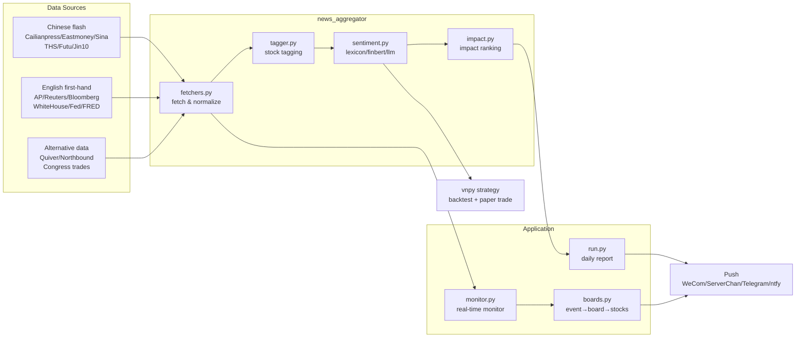

<div align="center">

# ⚡ FlashQuant · News-Driven Quant Toolkit

**Multi-source news aggregation · Real-time event monitoring · News-sentiment quantitative strategy**

> Aggregate 35+ financial data sources, capture market-moving news with an impact score, and run backtest + paper trading on vnpy.

[](https://github.com/pipi-520/FlashQuant/stargazers)
[](https://github.com/pipi-520/FlashQuant/network/members)
[](LICENSE)
[](https://www.python.org/)
[](https://github.com/pipi-520/FlashQuant/commits/master)

[English](README_EN.md) · [中文](README.md)

</div>

---

## ✨ What is this

`FlashQuant` is an open-source quantitative research toolkit for China A-shares and US stocks, focused on one question:

> **How to capture market-moving news as fast as possible, and turn it into backtestable, executable signals?**

It wires the whole pipeline together — data collection → sentiment scoring → impact ranking → real-time alerts → quantitative strategy — fully reproducible and free to run locally or on a cloud server.

## 🧩 Features

- **35+ data sources**: Chinese flash news (Cailianpress / Eastmoney / Sina / THS / Futu / Wallstreetcn / Jin10) + English first-hand (AP / Reuters / Bloomberg) + central banks & macro (Fed / ECB / BOJ / PBOC / FRED / CPI / NFP) + alternative data (Quiver / Northbound / Congress trades).
- **Pluggable sentiment engine**: `lexicon` (offline, zero-dependency), `finbert` (financial LLM) or `llm` (OpenAI-compatible), with automatic fallback to lexicon.
- **Impact score model**: combines source authority × burstiness × sentiment intensity × portfolio relevance × theme heat to surface what actually matters.
- **Real-time event monitor**: 15s polling + dedup + "event keyword → A-share concept/industry board → stocks" mapping, with instant push alerts (alert-only, no auto-trading).
- **Multi-channel push**: WeCom Work / ServerChan (WeChat) / Telegram / ntfy.
- **vnpy quantitative integration**: news-sentiment CTA strategy with historical backtest and local paper trading.
- **Production-ready deployment**: GitHub Actions daily reports + systemd 24/7 monitor + Docker, with one-click install and self-check scripts.

## 🏗️ Architecture



## 🚀 Quick Start

### 1. Install (Python 3.12)

```bash
python -m venv .venv
# Windows
.venv\Scripts\python -m pip install -r requirements.txt
# Linux / macOS
.venv/bin/python -m pip install -r requirements.txt
```

### 2. Run the news aggregator

```bash
python news_aggregator/run.py          # fetch + sentiment + impact + daily report
python news_aggregator/run.py --push   # also push to WeCom Work
```

### 3. Start the real-time monitor (24/7)

```bash
python news_aggregator/monitor.py               # daemon, 15s polling
python news_aggregator/monitor.py --once        # single round
python news_aggregator/monitor.py --dry-run     # detect only, no push
```

### 4. Run backtest + paper trading

```bash
python scripts/download_data.py       # download bars
python scripts/sentiment_score.py     # build sentiment series
python scripts/backtest.py            # vnpy backtest -> results/
python scripts/paper_trade.py         # local paper trading
python scripts/predictive_power.py    # event predictive-power study
```

## 📂 Project Structure

```
FlashQuant/
├─ news_aggregator/          # multi-source aggregation + real-time monitoring core
│  ├─ fetchers.py            #   35+ data source fetchers
│  ├─ sentiment.py           #   lexicon / finbert / llm sentiment backends
│  ├─ impact.py              #   impact score model
│  ├─ boards.py              #   event → A-share concept/industry board → stocks
│  ├─ themes.yaml            #   curated theme library (data-driven, extensible)
│  ├─ monitor.py             #   real-time event monitor
│  ├─ run.py                 #   daily aggregation + report
│  ├─ tagger.py / push.py    #   tagging / multi-channel push
├─ strategies/               # vnpy CTA strategy
├─ scripts/                  # bars / sentiment / backtest / paper / deploy scripts
├─ deploy/                   # systemd / Docker deployment
├─ news/                     # raw news archive + sentiment history (accumulated daily)
└─ config.yaml               # unified configuration
```

## 🔔 Alert Example

```
[Event Alert] Innovative Drugs / Vaccines
Theme: Innovative Drugs / Vaccines
Keywords: FDA / mRNA / anti-cancer / vaccine
Sentiment: +0.620  Impact: 0.84
Source: Cailianpress  Time: 2026-08-21 20:30:00
Text: US FDA approves a Phase-3 mRNA anti-cancer vaccine...
Related boards:
- Innovative Drugs (concept): Hengrui +2.1%, WuXi AppTec +1.8%
- Vaccines (concept): Zhifei +1.5%, Walvax +1.2%
```

## 📊 Data Sources

| Category | Sources |
|---|---|
| Chinese flash | Cailianpress · Eastmoney 7×24 · Sina 7×24 · THS 7×24 · Futu · Wallstreetcn · Jin10 · Policy RSS |
| English first-hand | AP · Reuters · AFP · Bloomberg (Google News RSS) |
| Central banks / macro | Fed · ECB · BOJ · BOE · PBOC · FRED · NFP/CPI · GDP/PCE · ISM PMI · EIA · OPEC/IEA · CFTC · VIX · AAII |
| Alternative data | Quiver · Northbound · Bargo Congress trades · SEC EDGAR |
| Industry | Semiconductor · Baltic Dry Index |
| Geopolitics / policy | White House · MFA China · US State Dept · Congress hearings · IMF/World Bank |

## 🗺️ Roadmap

- [x] 35+ source aggregation + sentiment + impact ranking
- [x] Real-time event monitor + multi-channel push
- [x] vnpy backtest + paper trading + cloud deployment
- [x] Event predictive-power study (`predictive_power.py`)
- [ ] Feed event signals into paper trading (capture → signal → trade loop)
- [ ] Auto-tune theme keywords and impact threshold from backtest results

## 📖 Docs

- [README（中文）](README.md)
- [Quant strategy guide（量化策略说明）](量化策略说明.md)
- [Cloud deployment](deploy/README.md)
- [Curated open-source stock projects](GitHub炒股实用项目推荐.md)

## 🤝 Contributing

Issues and PRs are welcome. See [CONTRIBUTING.md](CONTRIBUTING.md).

## ⭐ Star History

[](https://star-history.com/#pipi-520/FlashQuant&Date)

## ⚠️ Disclaimer

This project is for **learning and research only** and does not constitute investment advice. Markets are risky; trade at your own risk.

## 📄 License

[MIT](LICENSE) © 2026 [pipi-520](https://github.com/pipi-520)